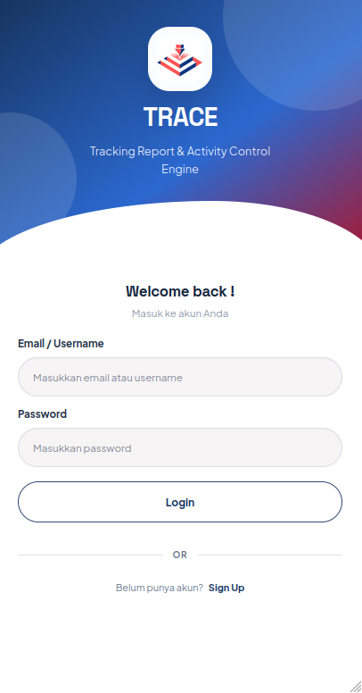
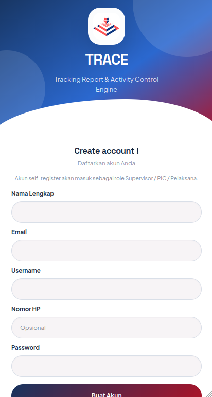
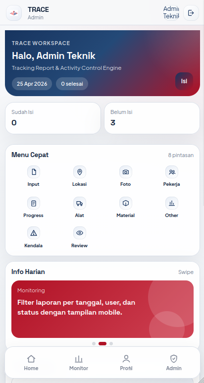
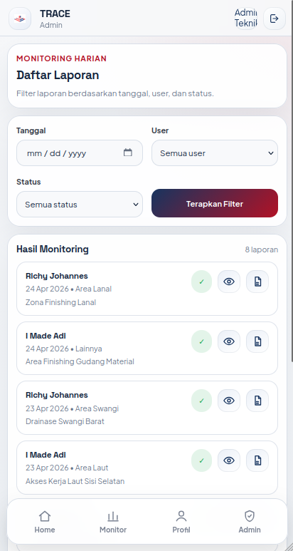
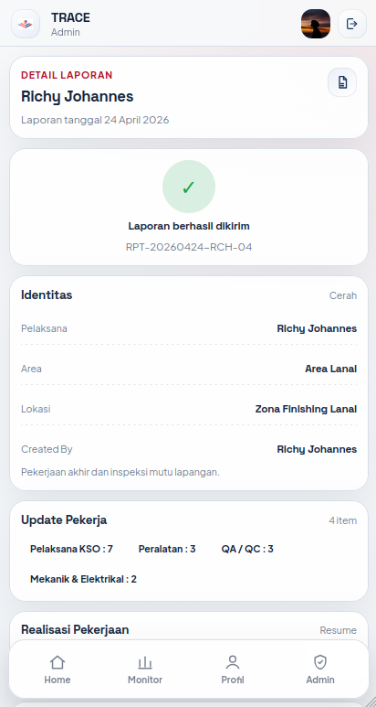
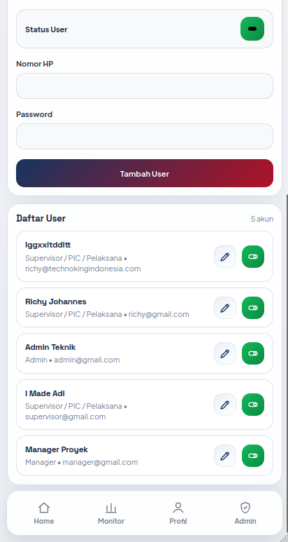
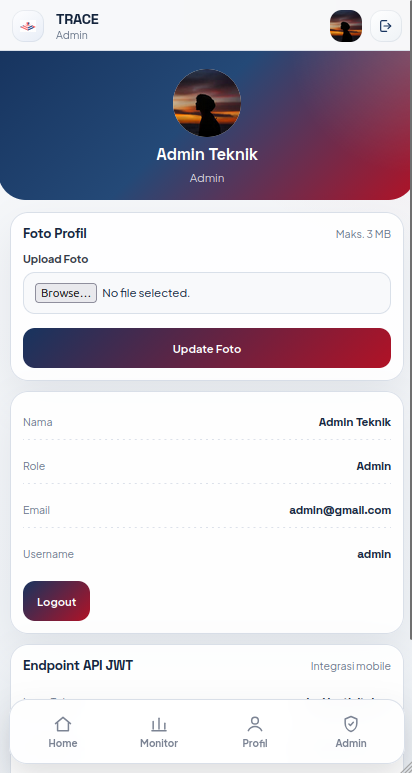

# TRACE

**TRACE** adalah aplikasi laporan harian lapangan berbasis mobile web untuk membantu tim proyek mencatat aktivitas pekerjaan, progres, kondisi lapangan, dokumentasi foto, hingga monitoring laporan per user.

Nama lengkap aplikasi ini adalah **Tracking Report & Activity Control Engine**.

## Preview Aplikasi

<table>
  <tr>
    <td width="50%" align="center">
      <strong>Login</strong><br>
      <a href="preview/login.png">
        
      </a>
    </td>
    <td width="50%" align="center">
      <strong>Sign Up</strong><br>
      <a href="preview/signup.png">
        
      </a>
    </td>
  </tr>
  <tr>
    <td width="50%" align="center">
      <strong>Dashboard</strong><br>
      <a href="preview/dashboard.png">
        
      </a>
    </td>
    <td width="50%" align="center">
      <strong>Input Laporan</strong><br>
      <a href="preview/report.png">
        
      </a>
    </td>
  </tr>
  <tr>
    <td width="50%" align="center">
      <strong>Detail Laporan</strong><br>
      <a href="preview/report-detail.png">
        
      </a>
    </td>
    <td width="50%" align="center">
      <strong>Master Data</strong><br>
      <a href="preview/masterdata.png">
        
      </a>
    </td>
  </tr>
  <tr>
    <td colspan="2" align="center">
      <strong>Profile</strong><br>
      <a href="preview/profile.png">
        
      </a>
    </td>
  </tr>
</table>

## Ringkasan Project

Project ini dibuat untuk mempermudah proses:

- input laporan harian lapangan
- penyimpanan draft laporan
- review dan submit laporan final
- monitoring laporan berdasarkan user, tanggal, dan status
- rekap singkat untuk admin dan manager
- export laporan ke PDF
- integrasi pengiriman ringkasan laporan ke WhatsApp

Secara umum, aplikasi ini cocok dipakai oleh tim operasional proyek yang membutuhkan pencatatan aktivitas harian secara cepat, rapi, dan terstruktur.

## Fitur Utama

- Login dan register user
- Dashboard home dengan menu cepat
- Input laporan harian bertahap per section
- Simpan draft laporan
- Review checklist sebelum submit final
- Detail laporan dan preview ringkasan WhatsApp
- Export laporan ke PDF
- Monitoring laporan untuk admin dan manager
- Manajemen user oleh admin
- Overview trend laporan untuk manager
- API berbasis JWT untuk kebutuhan integrasi

## Pembagian Role

### `Supervisor / PIC / Pelaksana`

Role ini adalah pengguna lapangan yang paling sering menggunakan aplikasi.

Tugas utamanya:

- login ke aplikasi
- membuat laporan harian
- menyimpan draft
- mengedit draft laporan
- submit laporan final
- melihat detail laporan
- membuka PDF laporan
- mengatur profil pribadi

Catatan:

- user yang melakukan register mandiri akan masuk ke role ini

### `Admin`

Role ini digunakan untuk pengelolaan sistem dan monitoring operasional.

Tugas utamanya:

- mengelola data user
- menambah user baru
- mengubah data user
- mengaktifkan / menonaktifkan user
- memonitor semua laporan
- memfilter laporan berdasarkan tanggal, user, dan status

### `Manager`

Role ini digunakan untuk melihat gambaran umum progres dan monitoring laporan.

Tugas utamanya:

- melihat monitoring laporan
- melihat overview tren laporan
- melihat ringkasan data cuaca dan progres
- melihat laporan terbaru

## Stack / Teknologi

Project ini menggunakan stack berikut:

- `PHP 8.2+`
- `CodeIgniter 4`
- `MySQL / MariaDB`
- `HTML, CSS, JavaScript`
- `Dompdf` untuk generate PDF
- `firebase/php-jwt` untuk API token JWT
- `Fonnte API` untuk integrasi WhatsApp

## Struktur Folder

Berikut struktur utama project:

```text
Project 1/
├── app/
│   ├── Config/          # Konfigurasi aplikasi, routes, validation
│   ├── Controllers/     # Controller halaman web dan API
│   ├── Database/        # Migration dan seeder database
│   ├── Filters/         # Filter auth dan role
│   ├── Libraries/       # Library tambahan, termasuk notifikasi WhatsApp
│   ├── Models/          # Model database
│   ├── Services/        # Business logic aplikasi
│   └── Views/           # Tampilan halaman
├── db/                  # File database schema dan data
├── preview/             # Screenshot preview aplikasi untuk README/repository
├── public/
│   ├── Assets/          # CSS, JS, image, vendor assets
│   └── Uploads/         # File upload user dan laporan
├── tests/               # Folder test
├── writable/            # Cache, logs, session, output runtime
├── .env                 # Konfigurasi environment lokal
├── composer.json        # Dependency PHP
└── README.md
```

## Setup Project di Local

Ikuti langkah berikut untuk menjalankan project ini di lokal.

### 1. Clone repository

```bash
git clone <url-repository>
cd "Project name"
```

### 2. Install dependency

```bash
composer install
```

### 3. Siapkan file environment

Pastikan file `.env` tersedia. Jika belum ada, copy dari file `env`.

```bash
cp env .env
```

Lalu sesuaikan konfigurasi berikut:

- `CI_ENVIRONMENT`
- `app.baseURL` jika diperlukan
- `database.default.hostname`
- `database.default.database`
- `database.default.username`
- `database.default.password`
- `database.default.port`
- `fonnte.token` jika fitur WhatsApp ingin digunakan
- `fonnte.groupId` jika fitur WhatsApp ingin digunakan

### 4. Setup database

Disarankan menggunakan migration + seeder agar struktur database selalu
sesuai dengan schema aplikasi terbaru.

#### Opsi A - Migration + Seeder

Jalankan migration:

```bash
php spark migrate
```

Lalu isi master data awal:

```bash
php spark db:seed TraceMasterSeeder
```

Seeder tersebut akan mengisi data dasar berikut:

- roles
- worker categories
- heavy equipment categories

Catatan:
Seeder ini tidak membuat akun user default. Akun `Supervisor` bisa dibuat
melalui fitur register, sedangkan akun `Admin/Manager` sebaiknya dibuat
secara manual atau melalui seeder terpisah sesuai kebutuhan deployment.

#### Opsi B - Import SQL Manual

Jika ingin menggunakan file SQL manual, folder `db/` tetap menyediakan
snapshot database.

File yang tersedia:

- `db/bytecorner_db_schema.sql` untuk struktur database
- `db/bytecorner_db_all_data.sql` untuk struktur + data

Jika ingin langsung memakai data yang lebih lengkap, gunakan:

```text
db/bytecorner_db_all_data.sql
```

Jika hanya ingin struktur database saja, gunakan:

```text
db/bytecorner_db_schema.sql
```

### 5. Jalankan aplikasi

```bash
php spark serve
```

Setelah itu buka browser ke:

```text
http://localhost:8080
```

## Kebutuhan Minimum

Sebelum menjalankan project, pastikan local environment memiliki:

- PHP 8.2 atau lebih baru
- Composer
- MySQL atau MariaDB
- extension PHP umum untuk CodeIgniter 4 seperti `intl`, `mbstring`, `json`, `curl`, `openssl`, dan `fileinfo`

## Cara Kerja Singkat

Alur penggunaan aplikasi secara umum:

1. User login ke aplikasi
2. Supervisor mengisi laporan harian per step
3. Laporan bisa disimpan sebagai draft terlebih dahulu
4. Laporan direview sebelum submit final
5. Setelah submit, laporan bisa dilihat detailnya, dibuat PDF, dan dikirim ke WhatsApp jika fitur aktif
6. Admin dan manager dapat memantau laporan dari halaman monitoring

## Modul Utama

### `Authentication`

- login
- register
- logout
- proteksi halaman berdasarkan auth dan role

### `Dashboard`

- home ringkas
- quick menu
- status pengisian laporan
- leaderboard pengisian

### `Reports`

- create report
- edit draft
- save draft
- review report
- submit final
- detail report
- export PDF

### `Admin Panel`

- user management
- report monitoring

### `Manager View`

- overview trend laporan
- ringkasan data cuaca
- daftar laporan terbaru

### `API`

- auth token JWT
- endpoint laporan

## Catatan Penting

- aplikasi ini dirancang dengan orientasi tampilan mobile
- file upload laporan disimpan di folder `public/Uploads/`
- file runtime seperti log, cache, session, dan output sementara berada di folder `writable/`
- jika fitur WhatsApp dipakai, token Fonnte wajib diisi melalui `.env`

## Saran Penggunaan

Jika Anda baru pertama kali membuka project ini, cukup pahami 4 hal berikut:

1. `Supervisor` bertugas mengisi laporan
2. `Admin` bertugas mengelola user dan memonitor laporan
3. `Manager` bertugas melihat ringkasan dan tren
4. untuk menjalankan project, fokus utama hanya pada `composer install`, konfigurasi `.env`, import database, lalu `php spark serve`

## Penutup

TRACE dibuat untuk membantu proses pelaporan harian lapangan agar lebih cepat, konsisten, dan mudah dimonitor. Dokumentasi ini ditujukan agar developer maupun user non-teknis bisa memahami fungsi project ini tanpa harus membaca keseluruhan source code terlebih dahulu.
